# Extension Experiment Report

**Name: Chen Lifeng**

**Class: C.S. 2201**

**Student Number: 22722005**

**Experiment Name: Alarm clock control light strip based on WS2812b**

### 1. Project Description

##### 1.1 Design Intention

As a Premier League fan, I often get up in the middle of the night to watch the game. But when you enter the group life of the university, the alarm clock or vibration at three or four o'clock in the morning will make the roommates warm up. To this end, I specially designed an alarm clock controllable light strip based on STM32, which can be used with the integrated blackout mosquito net in the dormitory, which can achieve the effect of silent wake-up, bed lighting, and colorful meteor tail-trailing.

Schematic diagram of the enclosed blackout mosquito net in the dormitory

##### 1.2 Implemetation Outcome

Considering the characteristics of the dormitory mosquito net, such as small space, no power outlets, and lack of lighting, my product uses STM32F103C8T6 as the main control, which greatly reduces the volume. At the same time, it is powered by 9V batteries or 5 No. 7 batteries, plus a one-button sleep mode, which avoids the use of power sockets and greatly improves battery life. In addition, in normal working condition, my product has three types of lights to choose from: Reading (white light), RGB1 (meteor trailing light), and RGB2 (dazzling dynamic light). The alarm clock of the product can also be set freely by the user, and when the alarm clock arrives at the time, the light strip will turn on the continuously changing colorful breathing light mode to achieve efficient wake-up for the user.

Schematic diagram of the inside of the mosquito net

### 2. Design Method

##### 2.1 Principle of WS2812b

WS2812B is a very common controllable strip light product, with programmable control, can be cut to length, and has the characteristics of various colors. It uses a series connection to combine multiple independent RGB three-color LEDs into a light strip, and each lamp bead integrates a WS2812 control chipIt is able to control its own color and brightness based on 24-bit data transmitted serially on a single wire, enabling display of up to 16777216 colors. This structure allows WS2812B to achieve high-resolution and responsive lighting effects, which are commonly found in a variety of interior and display applications, such as ceiling lights, backlight fill lights, etc. It is simple to drive, strong in practicability, and low in cost, but the material requirements of the data transmission line are high, and the single-wire control is also prone to confusion, so it needs to be controlled in combination with the main control chip in the way of DMA or software simulation in practical applications.

As we all know, the color used in our daily computer is determined by 6 hexadecimal numbers (such as 0xFFFFFF is white), specifically each lamp bead uses 24bit to represent its color, which is composed of: 8bit red channel, 8bit green channel, 8bit blue channel, and the resolution of each color channel is 256 levels.

As can be seen from the WS2812b reference manual, the transmission is sequential. And in the transmission process of the color signal of a single lamp bead, the high-level precedence is sent in the order of GRB.

From this, it can be seen that each LED needs 24 bits of data, so the total length of the data to be sent is (to control the number of LEDs n)\*(24), each LED saves 24 bits and transmits the remaining bits to the subsequent LEDs. After all the data is sent, the reset signal can be lit if the reset signal is sent. So the new question arises, how to represent the 0 and 1 of each bit?

The internal decoding logic of WS2812b is relatively simple, using a regular transmission mode, so that both new and old chips can achieve backward compatibility, and there is a strict time limit for the definition of high and low level changes, which can effectively prevent false triggering problems caused by line interference.

It can be seen that the 0 code in the WS2812b consists of a high level of 0.4us and a low level of 0.85us, and the 1 code consists of a high level of 0.8us and a low level of 0.45us, and tolerates an error of ± 600ns in total. Each LED saves 24 bits and passes the remaining bits to the subsequent LEDs.

It can be seen that D1 only accepts the first 24bit and transmits the last two 24bits to the lamp in the back. Therefore, in STM32, a timer can be used to output the duty cycle of the PWM corresponding signal, and each bit of the color array written in the flash can be transferred to the CCR register of the timer through DMA, so that the signal with different duty cycle can be continuously output to drive the continuously changing color.

In order to achieve a variety of color drives, there are also some ways to process RGB color signals, such as & \| Operation, shifting, taking random number function operation. These can lead to more varied colors.

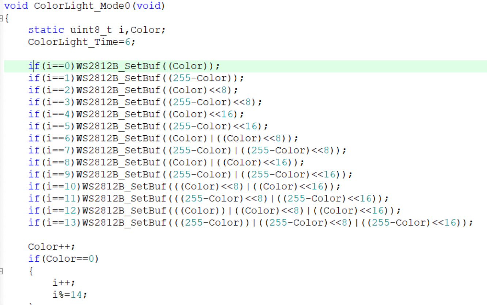

##### 2.2 Designing of the System

This controllable light has an auto-sleep function and a button to wake up and alarm clock. It was originally designed to be used in conjunction with RTC alarm wake-up via PWR standby mode. However, since PWR standby mode wakes up and executes from scratch, and turns off other peripheral clocks, it will clear all data except the BKP register after waking up, which will have a huge impact on the display of the current countdown. In addition, since the standby mode of the STM32 microcontroller is only for the kernel itself, it will not clear the status of other I/O ports in the standby state (for example, the light strip will continue to flash, and the OLED screen will continue to display), so the power consumption reduced by the standby mode is a bit upside down. To weigh the pros and cons, I chose an analog standby mode with the kernel on, but all peripherals off. In addition, the task triggered by the alarm interrupt is handed over to TIM4, which originally only handles automatic hibernation, which reduces the number of interrupts and improves the programmability of the code (the setting of alarm interrupts is far less flexible than that of timers). In this design, the main function is not executed from scratch every time it is woken, which reduces the number of interrupts, which in turn greatly reduces the number of errors. The basic flowchart for this product code is as follows:

The design of the key part is more responsible, and its simplified flow chart is as follows:

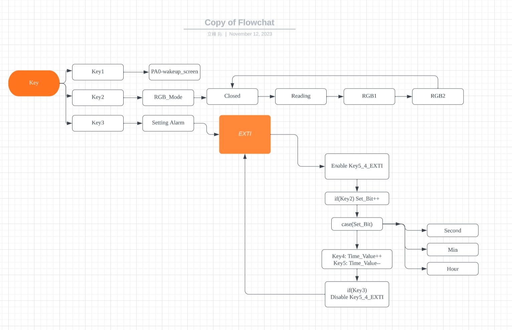

### 3. Project Advantages

##### 3.1 Code and Design Aspects

The teacher's coursework on STM32 design in such a course on digital systems is very helpful for us to increase our knowledge and understanding of computer structures such as interrupts, buses, and polling. At the same time, it also cultivated our ability to use single-chip microcomputer programming and design products, which greatly exercised the students' innovation ability. To this end, I have made a lot of use of interrupts and polling in the program, and I have also made full use of the STM32's built-in peripherals, such as timers, GPIOS, DMA, RTC clocks, etc., which is fully in line with the purpose of Coursework. Here, I'll introduce the benefits of the project with a few basic code highlights.

Key2 uses the invariance of static variables to judge the number of key presses by recording and comparing the previous key state. Since there is no need to define the pin level (pull-up or pull-down) in the floating state of the IO port like the external interrupt mode, the coupling of the code can be improved.

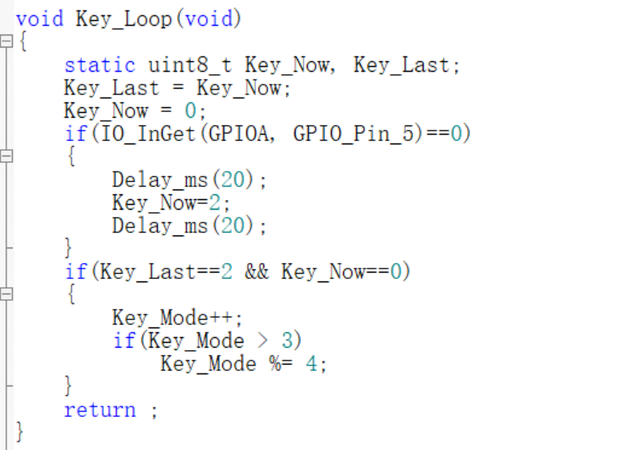

For keys that use external interrupts, a number of flag variables have been added to the design process to control the execution state of the main function through external keys.

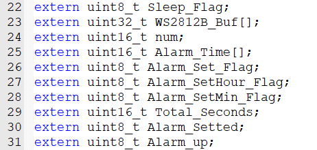

In addition, due to the priority of interrupts and the different execution time of interrupt functions, the occurrence of bugs can be reduced as much as possible by enabling and disabling interrupts in the design process.

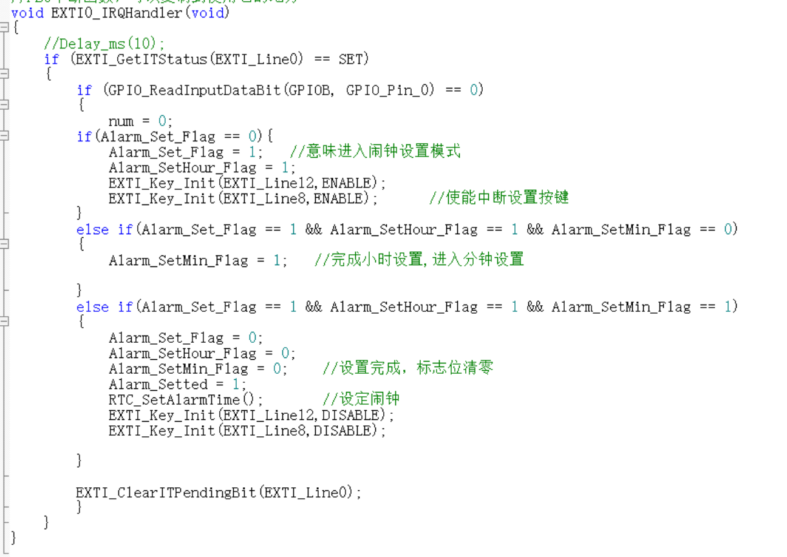

Instead of using the original RTC alarm interrupt (RTC alarm interrupt is not as flexible as using the timer directly), the timer is used in TIM4 to directly count the seconds, and the timer sleep and countdown alarm clock are operated at the same time.

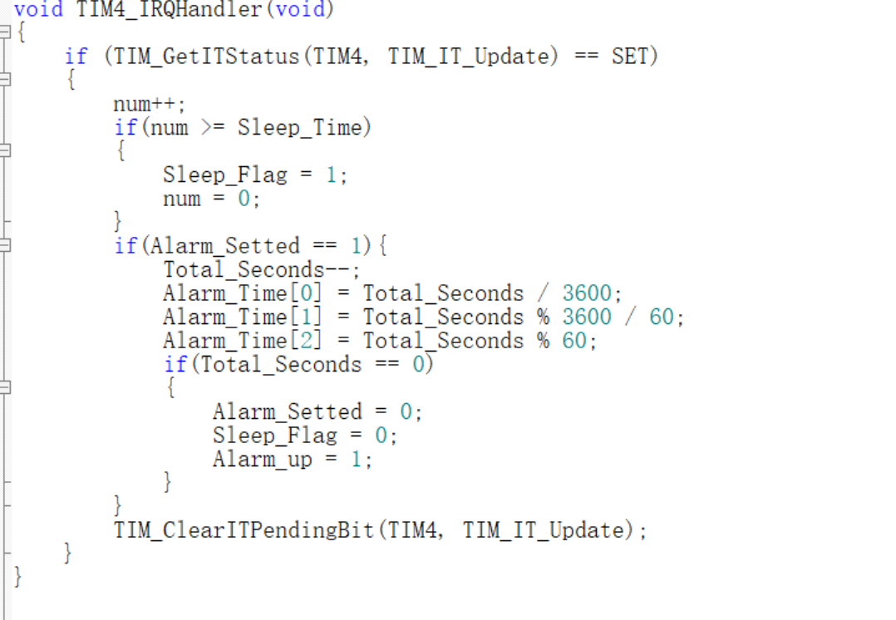

Make full use of C library functions, reduce the amount of code, and combine STM32 programming with the C language learned in the past. The processing of timestamps in the C language \<time.h\> is used here, which avoids the calculation of a series of problems such as leap years.

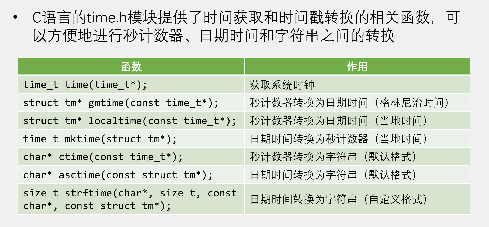

##### 3.2 Adequate Science Basis

According to the Cambridge University article on the effect of different color light sources on sleep quality, blue light and violet light are more conducive to the increase of corticosterone stress hormone levels, and the production of this hormone is a response to light, which actively inhibits sleep. Therefore, in this project, when the light alarm clock is awakened, a blue breathing light will be used, which is more conducive to the awakening of the sleeping person.

Schematic diagram of the wake-up effect

### 4. Achievement Display

This product mainly involves 6 buttons, which can be said to squeeze out all the GPIO port external interrupt channels on the STM32F103C8T6 main control chip, so as to make the best use of it, and its schematic diagram and function are introduced as follows:

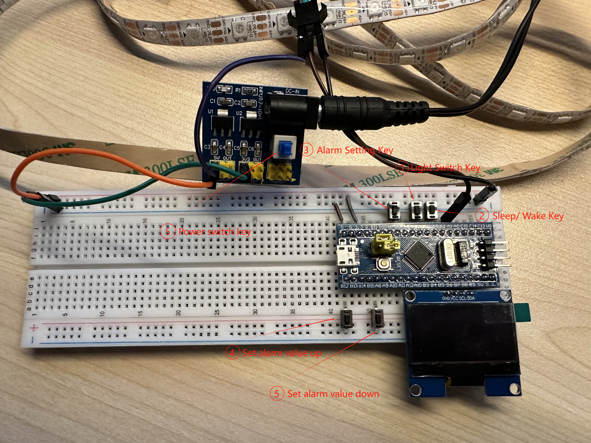

Button (1): Toggle the light effect to reading mode, colorful meteor trailing mode, streamer dynamic mode, and light off mode.

Button (2): Sleep/Wake button. One-click sleep can turn off all peripherals including displays, light strips, and other key controls to save power.

Button (3): Enter/exit alarm setting mode. Activate the button (4) and key (5) to allow the setting.

Button (4): Set the alarm value upwards.

Button (5): Set the alarm value downward.

The three light modes in normal working condition are as follows:

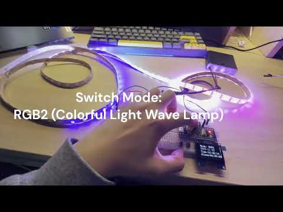

(Requires Youtuber to watch)

When the alarm time comes, the response is as follows:

(Requires Youtuber to watch)

Daily use scenarios:

(Requires Youtuber to watch)

### 5. Reflection and Further Outlook

##### 5.1 Reflections

When programming with STM32, I think one of the biggest advantages is that it is very innovative, and I can always combine something new with existing knowledge and equipment. Therefore, in the process of design, we should not be limited to the technology we have mastered, but dare to step out of our comfort zone, take the initiative to debug and learn new knowledge and technology, and develop products that are different from what we have done before. For myself, what I'm talking about is just basic on-chip peripherals and interrupt design, and it's not enough to design a product that is more convenient and suitable for modern life. The reflection is in the specific development, whether the latest modules are used, and whether they are aware of the latest technology. For example, I can try to design a remote control control, or directly use the mobile phone host app to control, and whether there are supporting measures after waking up, these are the directions I can pay attention to in the future.

##### 5.2 Improvement Ideas

If the battery is powered down, the microcontroller will lose the count of the RTC clock, considering that the STM32 has a VBAT pin, so it is best to add a coin cell battery as a backup power supply on the hardware side. Another way is to use an RTC module such as the DS1302, which can directly read the time array inside the chip using the GPIO port pin.

In addition, this project is based on an external interrupt that turns off the power supply of peripherals to simulate the sleep mode, and the microcontroller core is not a true sleep mode. In the STM32F1XX series, there are three power-saving modes that can be called by library functions: sleep mode, shutdown mode, and standby mode. According to incomplete statistics, the power consumption of these three modes is (normal mode: 10mA): sleep mode: 2mA, shutdown mode: 20uA, standby mode: 2uA. It can be seen that the power consumption of the core in standby mode is almost 1/5000th of that of normal mode

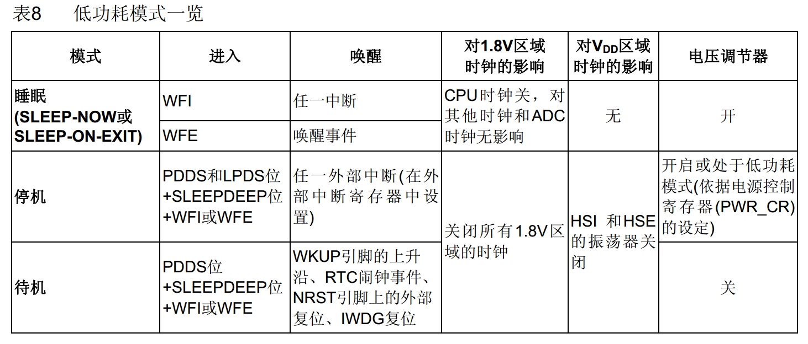

However, this method is difficult to program with library functions. For example, sleep mode and shutdown mode can be woken up by any external interrupt or event, which lacks restriction on wake-up, and at the same time, the shutdown mode will also turn off the peripheral clock (specifically, PLL, HSI and HSE), and once it is awakened, the clock source needs to be manually updated, which is undoubtedly a trouble for projects that have changed the number of peripherals in the running process PA0_WK\_ However, once in standby mode, the microcontroller loses all information except for some RTC-related registers and the backup register area, and the program is executed from the beginning after waking up. This has a huge impact on the initialization of the program and, above all, on the security of the information storage. For example, my product has the function of setting an alarm clock and displaying a countdown, but the microcontroller does not have a library function that can directly read the CNT of the alarm mode countdown, once it enters the standby mode, then the current countdown progress and the alarm clock time set by the user will disappear. For this reason, I have also considered using the DR registers in the BKP to save alarm data, and according to the manual, the STM32 has 10 16-bit backup registers, which can save the parameters in operation to avoid being lost after entering standby mode:

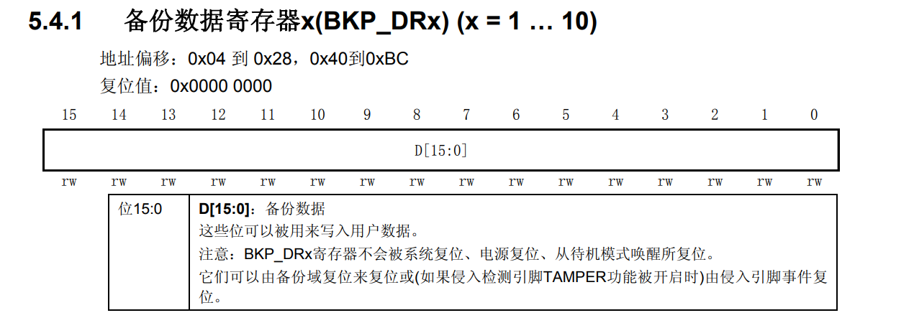

Therefore, in order to keep the current alarm progress after the standby wake-up, I thought of saving the timestamp of the alarm clock on and the total number of countdown seconds to the DR register, so that after the next wake-up, combined with the Unix timestamp obtained at the time of the current wake-up, the countdown progress of the alarm clock can be obtained, and the code is as follows:

However, it can be seen that the Unix timestamp is a 32-bit unsigned value, and to save the alarm setting time to a DR register with only 16 bits, it can only be stored in two parts, as shown in the code above, which is decomposed into a high 16-bit and a low 16-bit storage. Finally, in the while loop of the main function, the retained alarm progress is restored, and the code is as follows:

As mentioned earlier, in order to truly achieve standby, you need to ensure that the kernel and peripherals are on standby at the same time, so that only the kernel can be standby, but the peripherals still run on the LSE external low-speed clock. Therefore, in terms of hardware design, a voltage regulator with an enable terminal is usually used, and this is where the hardware side can be improved.
